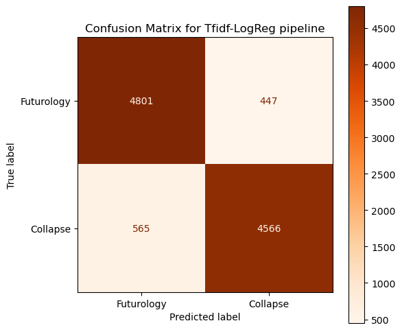

# Project 3: NLP cleaning and classification

## Executive Summary

Our lobbying group *Happy Days* is focused on solutions for increasing positivity and happiness.  We present our findings to the government as action items and policy changes that can be made to improve civic morale and mood.  

We've found two online subreddits on [reddit.com](http://reddit.com) that present an interesting dilemma. [r/collapse](https://www.reddit.com/r/collapse/) and [r/futurology](https://www.reddit.com/r/Futurology/) are both concerned with the longitude of society and the planet. But r/collapse is certain of the inevitability of collapse, which is defined as 
> a significant decrease in human population and/or political/economic/social complexity 

Whereas r/futurology is more speculative about 
>the development of humanity, technology, and civilization

r/collapse is more cynical and pessimistic, while r/futurology maintains an overall positive or neutral mood.  We want to identify what topics each group is talking about so that we can identify which topics lead to pessimistic thinking and which ones lead to a content or optimistic mood.  If we can understand what topics each group is focusing on, we can predict whether new events will be interpreted positively or negatively.  Additionally, we can hopefully present the most 'pessimistic' topics as suggestions for urgent policy action.

To answer this question, I developed a classification model to predict whether an online post belongs in r/collapse or in r/futurology.  This classification model will help our stakeholders better understand whether a post falls more in line with the doomsday approach of r/collapse or if it aligns with the more level-headed approach of r/futurology.  I used this model to identify the most indicative topics in both subreddits.  This model is not perfect, but there is also a lot of overlap between the topics discussed in both subreddits.  I performed some additional analysis on the posts that were misclassified to see if we can understand the limitations of the model.

Our group is best suited for this task because we are constantly thinking about how we can improve civic mood.  In aid of this, I have been working with Natural Language Processing models for a while now, and have developed the skills needed to effectively clean and prep text data for analysis.  Our model accuracy (88%) speaks for itself.

Let's work together and develop solutions to lift the mood of our people!

## Data Information

We pulled a large collection of posts from both subreddits, around 28,000 each.  The posts and metadata are saved to csv's in data/ in this repo.

The csv's store a wide variety of information available in each post's metadata.  I was only concerned about a few, explained in the data dictionary below.

|Feature|Type|Description|
|---|---|---|
|subreddit|*string*|name of the subreddit the post is from ('collapse' or 'futurology')|
|selftext|*string*|the text contained in the body of the post|
|title|*string*|the text contained in the title of the post|
|author|*string*|username of the post's author|
|num_comments|*int*|number of comments found on the post|
|upvote_ratio|*float*|ratio of upvotes (positive votes) to downvotes (negative votes)|
|permalink|*string*|permalink to the post on reddit|
|removed_by_category|*string*|reason post was deleted *or* NaN if post was not deleted|

## Text Cleaning

To develop the most effective model, I want to make sure that my text data is easy for the model to interpret.  This requires some cleaning from my end.  These are the steps I followed
* drop any posts that have a value for `removed_by_category`: these posts are either not relevant to the subreddit or break its rules, so they will not help with my predictions
* drop any observations which have null `selftext`.  Although these posts have titles, there is not even information left to be useful for the prediction, especially since many of the posts are small essays.
* drop duplicates: some of these are automod posts that generate a weekly thread for comments.  However, since we did not scrape the comments, these posts are not useful predictors.  And some of these duplicates are just actual duplicates - someone accidentally posted twice, or reddit had a glitch.
* drop any other Automod posts: they have no predictive value
* remove unicode, urls, and punctuation from the text posts
* remove numerics
* clean up extra whitespace
* remove the names of the subreddits themselves: this will lead to overfitting if we keep them in

## Exploratory Data Analysis

In this step, I calculated the word count of each post and compared the distributions in both subreddits.  The mean word count of collapse is higher than that of futurology (184 words vs 117 words) and the overall distribution of r/futurology is skewed left (more words in r/collapse).  This aligns with what I've seen - there tend to be more 'rants' and 'word dumps' on r/collapse.

I then also checked the distribution of the number of comments for each subreddit. r/collapse had a lot more posts with lots of comments, suggesting more engagement on that sub.

Word Count          |  Number of Comments
:-------------------------:|:-------------------------:
  |  

Then I analyzed the most common words in each subreddit (excluding stopwords).  This doesn't tell us predictive power yet, but lets us know what words show up the most in each set of posts.

Collapse          |  Futurology
:-------------------------:|:-------------------------:
  |  

## Modeling

### Metrics for evaluation

To evaluate each of the models I wanted to test, I created a dataframe to store all the scores.  For each model, I evaluated the accuracy (total % correct) of the training data, the accuracy of the testing data, and the roc-auc score.  By comparing my train/test scores, I can look for the model with a good bias/variance tradeoff.  And the roc-auc score tells me the separability or intermingling of my predictions.

### Comparing all the scores

I created multiple pipelines and scored all of them.  For the purpose of iterating through my models quickly, I used a 10% subset of my total data.  Those scores are reflected below.

|pipeline|vectorizer|model|train|test|roc|
|---|---|---|---|---|---|
|cv-logreg|cv|logreg|0.9865|0.8372|0.8366|
|**tfidf-logreg**|**tfidf**|**logreg**|**0.9509**|**0.8565**|**0.8563**|
|cv-knn|cv|knn|0.9997|0.5260|0.5206|
|tfidf-knn|tfidf|knn|0.9997|0.7842|0.7827|
|cv-rfc|cv|rfc|0.9627|0.8025|0.8020|
|tfidf-rfc|tfidf|rfc|0.9682|0.8006|0.8001|

The best performing model was a Logistic Regression with a TFIDF vectorizer.  Based on gridsearching hyperparameters, the best parameters for the `LogisticRegression` were the default values.  I did not gridsearch over the vectorizer params, but I only changed the `stop_words` parameter to exclude English.

## Conclusions and Next Steps
Based on the metrics I chose for evaluation, the TFIDF-LogisticRegression performed the best.  It did not have the highest training score, but it did have the highest testing score, so this also proved it was the least overfit.  The roc-auc score was also the highest, which suggests this model best separates the predictions.

As a final step, I fit this best model to the full training data set and made predictions on the full testing data set as well.  This helped me verify my results again.  

|dataset|training score|testing score|roc|
|---|---|---|---|
|10% sample|0.9509|0.8565|0.8563|
|full dataset|0.9188|0.8837|0.8837|

The testing score improved again! To a final accuracy of 88%.  Using the larger dataset helped reduce overfitting again, because the dimensionality of features to observations was in favor of observations this time.

The confusion matrix also showed that we had a similar number of correct predictions in both classes.  

### Feature Importance

After building the model, I wanted to revisit the idea of 'most important words'.  In EDA, I was only able to see which words were the most frequent in each subreddit, so there was a lot of overlap.  But by pulling out the coefficients of my logistic regression model, I can see which words are 'more important' to the target (the log of the odds that a post would belong to r/collapse).  As can be seen below, r/collapse focuses a lot on 'climate', 'change', 'extinction', 'oil', 'prepare', and 'survival ('hopium' is one of their favorite slang words).  On the other hand, r/futurology focuses on a lot more broad science and technology topics like 'ai', 'automation', 'robot', 'space' and 'singularity'.

Collapse          |  Futurology
:-------------------------:|:-------------------------:
  |  

### Strong Predictions vs Misclassifications

The next step was to evaluate some of the posts that were classified correctly and incorrectly.  The model did a pretty good job of evaluating extreme probability posts - posts over 99.9% (high probability it's part of r/collapse) were correctly classified, and posts under 0.03% (high probability it's part of r/futurology) were also correctly classified.  

I then looked at the posts that had closer to 0.5 probability.  These are the posts that the model had difficulty predicting.  Here are a couple examples:

* True: r/futurology; Predicted: r/collapse
> Is there precedent or law already laid down concerning the joining of nations into new territories/nations/states? Could the USA and Canada become Canadamerica/Americanada?
 I was watching Continuum and realized that I had no idea about international law concerning the creation of new nations between current ones. Not necessarily CA and US, but a number between some and all of the world's nation states will reform and/or combine at some point in the future.

* True: r/collapse; Predicted: r/futurology
> Can't visualize the future.
 I am currently applying to college. In recent years I have grown incredibly despondent about climate change and what I see as the inevitable downfall of the world as we know it. However, in the short term, I still need to go to college, which means writing essays about what I want to do in the future. I usually end up in tears because when I was younger I wanted to start a family and live to old age but now I genuinely am unable to imagine myself past the age of maybe 30? It's terrifying to me that at the time of my life when I'll be qualified to help with the climate, it might be too late.

* True: r/collapse; Predicted: r/futurology
> Would Hawaii sit out a hypothetical civil war?
 Since it's pretty far from the mainland...

* True: r/collapse; Predicted: r/futurology
> LIFEBOAT ETHICS In The Anthropocene

### Next Steps

* To flesh out this project further, I would try a few additional models with more hyperparamter grid-searching.  Unfortunately, because tuning is a CPU-heavy process, it's difficult to complete a lot in shorter time-frames.  
* Test models with a combination of unigrams and bigrams, but that is a big strain on the system

## Recommendations

* We recommend that the government uses discourse to emphasize the positively-received topics in r/futurology: `ai`, `automation`, `space`, etc
* We also would like to emphasize that `climate_change` was the most frequently discussed topic in r/collapse, meaning this is a critical area for government intervention and impactful policy changes.  Similarly, considering the focus on `oil`, there should be an effort to move away from oil and fossil fuels for energy.